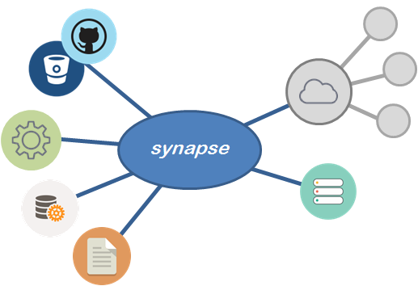

# Welcome to Synapse

Synapse is a lightweight execution engine designed to take data from disparate, federated sources and connect it to a process.  Synapse is built to run as a local or remote process.

<p align="center">

</p>

## Elements

A Synapse workflow, called a `Plan`, is comprised of a hierarhy of Actions.  An `Action` is essentially the definition of a local or remote process and the parameters required to initiate it.  Plans are declared in YAML, as follows:

```css
Action:
- Name: {string, friendly name}
  Proxy: {uri, remote Synapse node}
  ExecuteCase: {enum, status value}
  Handler:
    Type: {library}:{module}
    Config: {ParameterInfo}
  Parameters: {ParameterInfo}
  RunAs: {SecurityContext}
```
Where, `ParameterInfo` is:
```css
    Name: {string, friendly name}
    Type: {enum, Xml | Yaml | Json}
    Uri: {http:// | file://}
    Values:
      {Block of directly declared Xml|Yaml|Json as specified by Type}
    Dynamic:
    - Name: {friendly name}
      Path: {XPath or root:path0:path1}
      Options:
      - Key: {key}
        Value: {display value}
```
And `SecurityContext` is:
```css
    Name: {string, friendly name}
    Password: {ecrypted string}
    Provider: {Active Directory | AWS | Azure}
    Config: {ParameterInfo}
```

Essentially, Synapse takes data from various federated sources, provides the data to an action, and executes the action under a given security context.

A detailed description of Synapse Plan YAML is [here](/plan/ "Plan YAML").

## Components

| Component | Description
|--------|--------
|Synapse.Core|Contains the workflow execution engine and is responsible for initiating calls to sub-processes.
|Synapse.CommandLine|A CLI wrapper on Synapse.Core for local process execution.
|Synapse.Server|A server daemon designed to act as remote Synapse.Core agent.
|Synapse.Enterprise|An API interface to creating, storing, and executing Synapse Plans under an RBAC.  Manages exection log-capture and keeps detailed audit logs.

Detailed architectural descriptions and implementations patterns can be found [here](/architecture/ "Architecture").